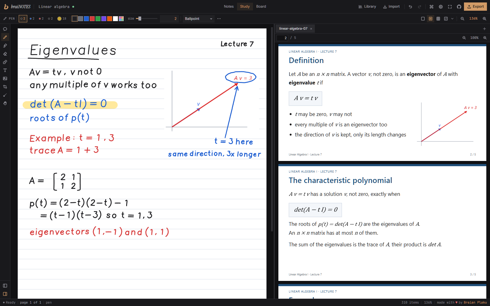

<p align="center">
  
</p>

<h1 align="center">braiNOTES</h1>

<p align="center">
  Handwritten notes and a whiteboard that run in your browser.<br/>
  Write with a pen, keep the pdf next to your notes.
</p>

<p align="center">
  
</p>

<p align="center">
  <a href="https://notes.swimmingbrain.dev"><strong>Try it now &rarr; notes.swimmingbrain.dev</strong></a>
</p>

braiNOTES is an open source app for writing by hand, like OneNote or GoodNotes, but in a browser tab. It is made for lectures: the slides open next to your notes or become the pages you write on. There is no account and no server, everything stays in your browser.

## Features

- Ballpoint, fountain pen, marker, pencil and highlighter, with pen pressure
- Notebooks on blank, lined, grid or dotted paper, and whiteboards without edges
- Write on a pdf, or read it on the side and snip parts of it into your notes
- Pictures, shapes, text, a lasso, an eraser and a laser pointer
- Export to PDF with the original pages and vector ink, or a page to PNG
- `.brainotes` files to back up a notebook or share it
- Saves by itself and works offline once it has been opened

## Shortcuts

| Key | What it does |
|-----|--------------|
| `P` `H` `E` `V` | Pen, highlighter, eraser, select |
| `S` `T` `X` `L` | Shapes, text, snip, laser |
| `Space` | Hand while held |
| `Ctrl+Z` `Ctrl+Shift+Z` | Undo, redo |
| `Ctrl+Enter` | New page |
| `PageDown` `PageUp` | Next and previous page |
| `Ctrl+1` `Ctrl+2` `Ctrl+3` | Notes, Study, Board |
| `Ctrl+Shift+F` | Present in fullscreen |
| `Ctrl+K` | Command palette |
| `?` | All shortcuts |

## Running locally

```bash
pnpm install
pnpm dev
```

Open `http://localhost:5173`. `pnpm test` runs the tests, `pnpm check` the type checks and `pnpm build` writes the static site to `build/`. See [docs/CONTRIBUTING.md](docs/CONTRIBUTING.md) if you want to help.

## How it works

- Ink is drawn into cached canvas tiles, only the tiles where something changed are drawn again.
- A stroke is an outline from perfect-freehand, made from the points and the pen pressure.
- The line is drawn the moment the pen moves. A one euro filter calms a shaky hand while you write and a light refit runs when the pen lifts.
- PDFs are drawn by pdf.js in a worker, only the pages you see and at the zoom you see them.
- Notebooks, pages and files live in IndexedDB and are saved a moment after every change.
- A `.brainotes` file is a zip with the notebook, one json file per page and the pdfs and pictures.
- The PDF export puts the original pdf pages into the file and the ink on top as vectors.

## Tech stack

| Part | Library |
|------|---------|
| Framework | Svelte 5 + SvelteKit (static adapter) |
| Strokes | perfect-freehand |
| Reading PDFs | pdf.js |
| Writing PDFs | pdf-lib (the pdfme fork) |
| Storage | IndexedDB through idb |
| Files | fflate, browser-fs-access |
| Language | TypeScript |

## License

MIT, see [LICENSE](LICENSE). The libraries keep their own licenses, [THIRD_PARTY_LICENSES](THIRD_PARTY_LICENSES) lists them.
